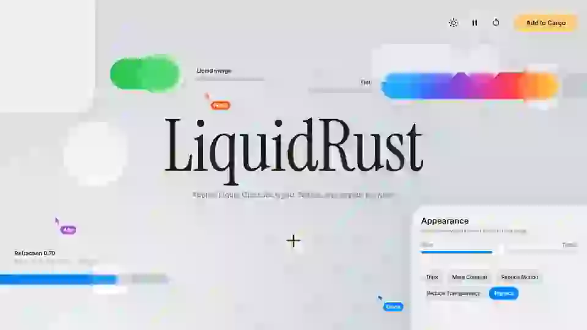

# LiquidRust showcase

A sample app for [liquid-rust](https://github.com/al1h3n/liquid-rust): Apple’s Liquid Glass,
written in Rust on wgpu and running in the browser through WebGPU. Every control on the page
is real liquid-rust glass. Three scripted cursors use the controls until you touch the page:
Ferris works the switch, the refraction slider, the light and the primary button; Ada drags
the lens and the tint; Grace runs the menu and the Appearance panel, changing contrast,
transparency, physics and dark mode while the other two are mid-gesture, so you see each
setting act on glass that is moving.

**[Try it live →](https://al1h3n.github.io/liquid-rust-showcase/)** (needs a browser with WebGPU)

<!-- Video: on github.com, edit this file, drag media/showcase.mp4 in, and keep the
     https://github.com/user-attachments/assets/… link it inserts here, on its own line. -->

[](https://al1h3n.github.io/liquid-rust-showcase/)

▶ [Full recording, 1080p60 (`media/showcase.mp4`)](media/showcase.mp4)

## Run it

The built wasm is committed, so after cloning, `cargo run` is all you need. It requires
Rust 1.99+ and a browser with WebGPU (Chrome or Edge 113+, Safari 26+, Firefox 141+ on Windows).

```bash
cargo run
```

Then open the address it prints, normally <http://127.0.0.1:8080>. If 8080 is taken, it uses the
next free port; `cargo run -- 9000` picks one. `cargo run` is a small std-only static server
([`src/bin/serve.rs`](src/bin/serve.rs)); any static server pointed at the repo root works too.

To rebuild after changing `src/lib.rs` or updating liquid-rust, follow [`build.txt`](build.txt)
(needs [`wasm-pack`](https://rustwasm.github.io/wasm-pack/)). The live demo is GitHub Pages
serving this repo's `main` branch from the root; [`index.html`](index.html) forwards to `www/`.

## What’s on the page

| On screen | What it shows | liquid-rust API |
|---|---|---|
| The liquid pair over the spectrum | Two shapes fuse with a liquid neck and pinch apart as they drift | `Scene::add_container(spacing, z)`, `Glass::container` |
| **Liquid merge** switch | Turns merging off and on live. The knob stretches toward where it’s going, then bounces | `Scene::set_container_spacing`, `Scene::set_frame_with(Spring::new(0.5, 0.32))` |
| The lens over the title | Drag it. It lifts, stretches with speed, refracts the serif and jiggles when dropped | `Glass::lens()`, `pointer_down` / `pointer_move` / `pointer_up` |
| **Refraction** slider | Its glass knob is a lens on a track; the value drives the lens’s Figma knobs | `Material { refraction, depth, .. }`, `Scene::set_material` |
| **Tint** slider | Picks the stained-glass colour of the primary button (and the lens when it’s tinted) | `Material::tinted(color)` |
| **Add to Cargo** | The one tinted primary action. Copies `cargo add`; a toast materializes and dematerializes through lensing | `Scene::add`, `Scene::remove` |
| **+** button | A menu grows out of it, stretching a neck, and collapses back into it | `Scene::expand_from`, `Scene::collapse_into` |
| Menu rows | Switch the lens between Clear, Regular and Tinted, or hide and show it | `Material::clear()` / `regular()` / `tinted()`, `remove`, `add` |
| Toolbar ☀ | Sweeps the specular light around every rim (the cursors also tilt it slightly) | `Scene::set_light_angle` |
| Toolbar ⏸ / ↺ | Pause the cursors (or press Space), reset everything | |
| **Appearance** panel | The iOS 27 transparency slider, dark scheme, More Contrast, Reduce Transparency, Reduce Motion, physics on/off | `Appearance { transparency, dark, increase_contrast, reduce_transparency, reduce_motion }`, `Scene::physics` |
| Pressing any button | It grows and lights up from the finger, then springs back | `Glass::interactive()` |
| The lens over the **+** button | Glass on glass: the upper layer refracts the glass rendered below it | `Glass::z`, container `z` |
| The big panels | Apple’s continuous squircle corners; capsules everywhere else | `Shape::Rounded(r)`, `Shape::Capsule` (`Circular`, `Smooth` also exposed) |

The page starts from your system settings: `prefers-color-scheme`, `prefers-contrast`,
`prefers-reduced-motion` and `prefers-reduced-transparency` seed the Appearance panel.
Add `?nomedia` to ignore them, `?theme=dark` to start dark, or `?still` to start without cursors.
Keys: Space pauses the cursors, `D` dark, `C` contrast, `M` reduce motion, `T` reduce transparency, `P` physics.

## How it’s built

```
back   2D canvas, offscreen   background, title, captions, slider and switch fills
  │    uploaded with Showcase::setContent → copy_external_image_to_texture
glass  WebGPU canvas          liquid-rust: content + every glass shape (one Scene, one Renderer)
ink    2D canvas on top       glyphs and labels sitting on the glass, the scripted cursors
```

- [`src/lib.rs`](src/lib.rs) is the Rust side: a `wasm-bindgen` wrapper that owns the wgpu
  device, the `Scene` and the `Renderer`, and exposes the whole API to JavaScript (shapes,
  materials and their knobs, springs, frames, containers, appearance, light, physics, input).
  Unlike liquid-rust’s own `web/` binding it takes a live canvas as content, so the glass
  refracts things that move.
- [`www/app.js`](www/app.js) lays out the scene, draws the content and labels, routes input
  and runs the cursors on a simulated clock.
- The content is redrawn and uploaded only while something moves; the loop stops when
  `Scene::update` reports rest and no cursor is playing.
- Labels sit on top of the glass, as liquid-rust’s contract asks, never inside it.
  The panel’s controls are fills on glass, not glass on glass.

## Record the video

[`tools/record.mjs`](tools/record.mjs) drives headless Chrome over the DevTools protocol.
The page has a deterministic clock (`?record`), so every frame is stepped, captured and piped
to ffmpeg. That gives smooth 60 fps however slow the capture is, and the 28-second loop
is seamless. It needs Node 22+, Chrome or Edge, and ffmpeg on `PATH`. There are no npm packages.

```bash
node tools/record.mjs                                   # media/showcase.mp4
node tools/record.mjs --stills 4,13.6,17.5 --out media/stills
node tools/record.mjs --seconds 6 --width 1280 --height 720 --out media/clip.mp4
```

## Layout

```
Cargo.toml         liquid-rust from git, wasm-only deps under cfg(wasm32)
src/lib.rs         the wasm binding (Showcase)
src/bin/serve.rs   `cargo run` static server
www/               index.html, style.css, app.js, pkg/ (committed wasm build)
index.html         GitHub Pages entry, forwards to www/ (.nojekyll skips Jekyll)
build.txt          how to rebuild and publish the live demo
tools/record.mjs   frame-exact recorder
media/             showcase.mp4, showcase.webp, poster.png
```

Licensed under either of [MIT](LICENSE-MIT) or [Apache-2.0](LICENSE-APACHE), at your option.

Fonts: Instrument Serif, Inter and JetBrains Mono from Google Fonts (SIL OFL).
